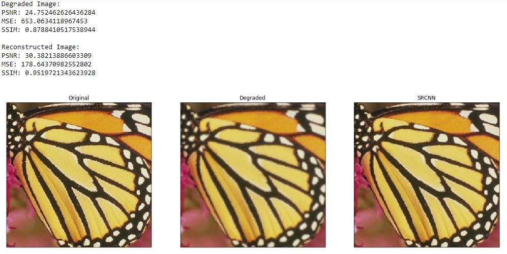

# Image-Super-Resolution-with-SRCNN

The original paper is [Learning a Deep Convolutional Network for Image Super-Resolution](https://arxiv.org/abs/1501.00092)

  

## This Project 

- [x] Use the PSNR, MSE, and SSIM image quality metrics
- [x] Process images using OpenCV
- [x] Convert between the RGB, BGR, and YCrCb color spaces
- [x] Build SRCNN deep neural network architecture in Keras
- [x] Deploy and evaluate the SRCNN network 

## Use:
Execute:
`python SRCNN.py`

## Results

  

### Colab Demo (Coming Soon)

## Author
You can get in touch with me on my LinkedIn Profile:

#### Saad Hassan

You can also follow my GitHub Profile to stay updated about my latest projects: 

If you liked the repo then kindly support it by giving it a star ⭐!

If you find any bug in the code or have any improvements in mind then feel free to generate a pull request.

## Issues

If you face any issue, you can create a new issue in the Issues Tab and I will be glad to help you out.

## LICENSE
- MIT (2021)
